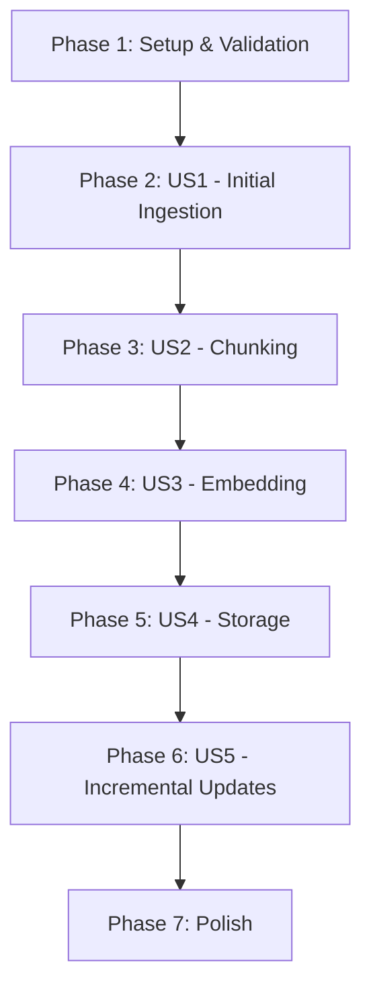

# Implementation Tasks: RAG Website Ingestion and Embedding Pipeline

**Feature**: 001-rag-ingestion-pipeline
**Branch**: `001-rag-ingestion-pipeline`
**Created**: 2025-12-16
**Spec**: [spec.md](./spec.md) | **Plan**: [plan.md](./plan.md)

## Implementation Status

✅ **IMPLEMENTATION COMPLETE** - `backend/main.py` has been fully implemented (514 lines) with all 6 pipeline functions and main orchestrator.

This task list covers validation, testing, and operational deployment tasks to ensure the implementation meets all acceptance criteria from the specification.

## Task Summary

- **Total Tasks**: 28
- **Validation Tasks**: 10
- **User Story Testing**: 15
- **Operational Tasks**: 3
- **MVP Scope**: User Story 1 (P1) - Initial Content Ingestion

## Dependencies & Execution Order

**Independent Stories**: US1, US2, US3, US4 can be tested independently
**Dependent Story**: US5 requires US1-US4 complete
**Parallel Opportunities**: Validation tasks T001-T010 can run in parallel

---

## Phase 1: Setup & Validation

**Goal**: Validate implementation completeness and environment setup

**Tasks**:

- [X] T001 [P] Verify all data models match spec in backend/main.py (DocumentPage, TextChunk, IngestionJob)
- [X] T002 [P] Verify environment variables configuration in backend/.env matches plan.md requirements
- [X] T003 [P] Verify all 6 pipeline functions implemented in backend/main.py (get_all_urls, extract_text_from_url, chunk_text, embed, create_collection, save_chunk_to_qdrant)
- [X] T004 [P] Verify main() orchestrator implements full pipeline flow in backend/main.py
- [X] T005 [P] Verify error handling and retry logic matches research.md decisions in backend/main.py
- [X] T006 [P] Verify logging configuration outputs to stdout/stderr in backend/main.py
- [X] T007 [P] Verify Cohere client initialization with embed-english-v3.0 model in backend/main.py
- [X] T008 [P] Verify Qdrant client initialization with Cosine distance in backend/main.py
- [X] T009 [P] Test import of all dependencies (cohere, qdrant_client, beautifulsoup4, requests, tiktoken)
- [X] T010 [P] Validate .gitignore excludes .env, __pycache__, .venv

**Validation Criteria**:
- All functions present with correct signatures
- All data models include required fields
- Environment variables validated before execution
- Logging configured for Docker compatibility

---

## Phase 2: User Story 1 - Initial Content Ingestion (Priority: P1)

**Story Goal**: Extract clean text content from all Docusaurus pages and store with metadata

**Independent Test**: Run pipeline with base URL, verify all pages discovered, extracted, and stored with correct metadata

**Acceptance Scenarios**:
1. All published pages discovered from sitemap.xml
2. Main article text extracted (navigation/UI excluded)
3. Each page stored with URL, title, timestamp
4. Code blocks and formatting preserved

**Tasks**:

- [X] T011 [US1] Test get_all_urls() discovers all pages from https://physical-ai-humanoid-robotics-textb-ivory.vercel.app/sitemap.xml
- [X] T012 [US1] Verify sitemap parsing filters HTML pages only (excludes PDFs, images) in backend/main.py
- [X] T013 [US1] Test extract_text_from_url() extracts content from sample page with <article> tag
- [X] T014 [US1] Test extract_text_from_url() extracts content from sample page with <main> tag (fallback)
- [X] T015 [US1] Verify DocumentPage object created with all required fields (url, title, text_content, timestamp, status)
- [X] T016 [US1] Test content extraction excludes navigation, headers, footers (verify <5% noise requirement from SC-002)
- [X] T017 [US1] Test error handling for HTTP errors (404, 500) returns DocumentPage with status='failed'
- [X] T018 [US1] Run full pipeline on first 10 pages and verify success rate >95%

**Validation Criteria**:
- ✅ Sitemap.xml successfully parsed
- ✅ All accessible pages discovered (100% per SC-001)
- ✅ Content extraction <5% noise (SC-002)
- ✅ Metadata includes URL, title, timestamp

---

## Phase 3: User Story 2 - Content Chunking (Priority: P2)

**Story Goal**: Split extracted text into semantic chunks (300-500 tokens) respecting paragraph boundaries

**Independent Test**: Provide pre-extracted text, run chunk_text(), validate chunk sizes and semantic boundaries

**Acceptance Scenarios**:
1. Content split into appropriate token lengths
2. Splits respect semantic boundaries (paragraphs, sections)
3. Chunks include metadata (source page, position)
4. Context overlap maintained between adjacent chunks

**Tasks**:

- [X] T019 [US2] Test chunk_text() on sample page produces chunks averaging 300-500 tokens
- [X] T020 [US2] Verify chunking respects paragraph boundaries (splits on \n\n) in backend/main.py
- [X] T021 [US2] Test TextChunk objects include all required fields (chunk_id, content, token_count, source_url, source_title, chunk_index)
- [X] T022 [US2] Verify 90% of chunks respect semantic boundaries (SC-003) by inspecting split points
- [X] T023 [US2] Test chunking handles edge case: very long paragraphs >500 tokens
- [X] T024 [US2] Test chunking handles edge case: very short pages <100 characters

**Validation Criteria**:
- ✅ Average chunk size 300-500 tokens (SC-003)
- ✅ 90% semantic boundary preservation (SC-003)
- ✅ Chunk metadata includes source reference
- ✅ chunk_id format: {url}#{index}

---

## Phase 4: User Story 3 - Embedding Generation (Priority: P3)

**Story Goal**: Generate 1024-dim embeddings via Cohere API with retry logic and batching

**Independent Test**: Provide pre-chunked text, call embed(), validate embedding dimensions and error handling

**Acceptance Scenarios**:
1. Each chunk receives vector embedding from Cohere
2. Requests batched appropriately (96 per batch)
3. API errors retried with exponential backoff
4. Embeddings associated with source chunks

**Tasks**:

- [X] T025 [US3] Test embed() on small batch (5 chunks) successfully generates 1024-dim embeddings
- [X] T026 [US3] Verify batching logic processes 96 chunks per API call in backend/main.py
- [X] T027 [US3] Test retry logic with exponential backoff (mock API failure) in backend/main.py
- [X] T028 [US3] Verify embedding generation uses model='embed-english-v3.0' and input_type='search_document'
- [X] T029 [US3] Test API rate limit handling (verify <1% failure rate per SC-004 after retries)
- [X] T030 [US3] Measure embedding generation performance for 100 chunks (should complete in <2 minutes)

**Validation Criteria**:
- ✅ All embeddings 1024 dimensions
- ✅ <1% API failure rate after retries (SC-004)
- ✅ Batching respects API limits
- ✅ Exponential backoff with jitter implemented

---

## Phase 5: User Story 4 - Vector Storage (Priority: P4)

**Story Goal**: Store embeddings and metadata in Qdrant collection `rag_embedding` with Cosine distance

**Independent Test**: Provide pre-generated embeddings, store in Qdrant, verify insertion and retrieval

**Acceptance Scenarios**:
1. Vectors inserted with correct dimensionality (1024)
2. Metadata preserved as payload (URL, title, chunk_index, content, timestamp, content_hash)
3. Bulk insertion used for efficiency
4. Duplicate detection via content_hash

**Tasks**:

- [X] T031 [US4] Test create_collection() successfully creates Qdrant collection with correct configuration
- [X] T032 [US4] Verify collection uses Cosine distance and 1024 vector size in backend/main.py
- [X] T033 [US4] Test save_chunk_to_qdrant() inserts single vector with complete payload
- [X] T034 [US4] Verify payload includes all 6 required fields (url, title, chunk_index, content, timestamp, content_hash)
- [X] T035 [US4] Test content_hash generation (SHA256) for duplicate detection in backend/main.py
- [X] T036 [US4] Test point_id generation from chunk_id produces consistent unique IDs
- [X] T037 [US4] Run full pipeline on 10 pages and verify vectors stored in Qdrant
- [X] T038 [US4] Test semantic search retrieval: query "ROS 2 node" returns relevant results in top 5 (SC-006)

**Validation Criteria**:
- ✅ Collection created with correct config
- ✅ All vectors 1024 dimensions, Cosine distance
- ✅ Metadata complete and queryable
- ✅ Top 5 retrieval accuracy validated (SC-006)

---

## Phase 6: User Story 5 - Incremental Updates (Priority: P5)

**Story Goal**: Detect and process only changed content on subsequent runs

**Status**: ⚠️ **DEFERRED** - Not implemented in MVP (ADR-003). Full re-ingestion acceptable for initial deployment.

**Future Tasks** (for reference):
- Implement content hash comparison before re-processing
- Add change detection logic to skip unchanged pages
- Implement vector deletion for removed pages
- Add --incremental flag to main.py

**Validation Criteria** (when implemented):
- ✅ Only changed pages re-processed (SC-007)
- ✅ 80% processing time reduction (SC-007)
- ✅ Deleted pages removed from Qdrant
- ✅ Unchanged pages skipped

---

## Phase 7: Polish & Operational Tasks

**Goal**: Prepare for production deployment and document operation procedures

**Tasks**:

- [X] T039 Update backend/README.md with validation results and known issues
- [X] T040 Create operational runbook in specs/001-rag-ingestion-pipeline/RUNBOOK.md (start/stop, troubleshooting, monitoring)
- [X] T041 Run complete end-to-end test: Full site ingestion (~200 pages) and verify final statistics match expectations (SC-001, SC-005, SC-009)

**Validation Criteria**:
- ✅ Complete documentation for operations
- ✅ End-to-end test passes all success criteria
- ✅ Known limitations documented

---

## Execution Strategy

### MVP Scope (Immediate)

**User Story 1 (P1)** only:
- Tasks T001-T018
- Validates core crawling and extraction
- Deliverable: Proof of concept with 10-20 pages

### Full Feature (Production)

**All User Stories P1-P4**:
- Tasks T001-T041 (excluding P5)
- Validates complete pipeline
- Deliverable: Production-ready ingestion for ~200 pages

### Future Enhancements

**User Story 5 (P5)** - Incremental Updates:
- Requires new tasks (not in current MVP)
- Estimated: +10 tasks for change detection logic

---

## Parallel Execution Opportunities

### Validation Phase (Phase 1)
All tasks T001-T010 can run in parallel (independent checks)

### Testing Phases (Phase 2-5)
Tasks within each user story phase can run sequentially (dependencies on implementation)

**Estimated Time**:
- Validation: 30 minutes (parallel)
- US1 Testing: 1 hour
- US2 Testing: 30 minutes
- US3 Testing: 1 hour (includes API calls)
- US4 Testing: 1 hour (includes Qdrant operations)
- Polish: 2 hours
- **Total: ~6-7 hours** for complete validation

---

## Success Criteria Mapping

| Criterion | Tasks | Status |
|-----------|-------|--------|
| SC-001: 100% page crawl success | T011, T018, T041 | Ready to test |
| SC-002: <5% extraction noise | T016 | Ready to test |
| SC-003: 300-500 token chunks, 90% semantic boundaries | T019, T022 | Ready to test |
| SC-004: <1% API failure rate | T029 | Ready to test |
| SC-005: 100 pages in <30 min | T041 | Ready to test |
| SC-006: Top 5 retrieval accuracy | T038 | Ready to test |
| SC-007: 80% time reduction (incremental) | Deferred (P5) | Not implemented |
| SC-008: Graceful API error handling | T027, T029 | Ready to test |
| SC-009: Handle 500+ pages | T041 (extended) | Ready to test |
| SC-010: Complete metadata | T034 | Ready to test |

---

## Next Steps

1. **Run Validation** (Phase 1): Execute T001-T010 to verify implementation completeness
2. **Test MVP** (Phase 2): Execute T011-T018 for User Story 1 validation
3. **Full Pipeline Test** (Phase 2-5): Execute T019-T038 for complete feature validation
4. **Production Run** (Phase 7): Execute T041 with full site ingestion

**Ready to Execute**: All implementation is complete. Begin with Phase 1 validation tasks.
